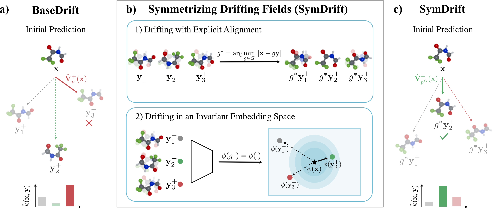

<div align="center">

# SymDrift: One-Shot Generative Modeling under Symmetries


<!-- [](https://arxiv.org/abs/2605.06140) -->
[](https://arxiv.org/abs/2605.06140)
[](https://doi.org/10.5281/zenodo.23008152)



</div>

Implementation of [SymDrift: One-Shot Generative Modeling under Symmetries](https://arxiv.org/abs/2605.06140) by S Darouich, V Tong, L Pastor-Pérez, T Bien, L Mualem and M Niepert. The paper was accepted at [NeurIPS 2026](https://arxiv.org/abs/2605.06140).

> Generative modeling of physical systems often requires respecting global symmetries such as rotations and translations. SymDrift introduces symmetry-aware drifting models for efficient one-shot generation in molecular systems, enabling up to **40× faster inference** compared to multi-step diffusion and flow matching approaches while maintaining competitive performance.

---

## Overview

SymDrift addresses a fundamental challenge in one-shot generative modeling under symmetries:  
even if a generator is equivariant, the corresponding drifting field is generally **not** invariant under symmetrization of the target distribution.

To overcome this issue, SymDrift introduces two complementary approaches:

- **Symmetrized coordinate-space drifting**
  - based on optimal alignment of molecular structures
- **G-invariant latent embeddings**
  - removing symmetry ambiguity by construction

---

## Installation

Clone the repository:

```bash
git clone <repo-url>
cd symdrift
```

Create an environment and install dependencies:

```bash
conda create -n symdrift python=3.10
conda activate symdrift
pip install -e .
pip install torch_scatter torch_sparse torch_cluster -f https://data.pyg.org/whl/torch-2.8.0+cu128.html
python -m pip install "torch-linear-assignment==0.1.0rc0"
```

### CUDA-Accelerated Hungarian Algorithm

For improved performance of the Hungarian matching step, we use the CUDA-compatible implementation provided by:

- [torch-linear-assignment](https://github.com/ivan-chai/torch-linear-assignment)

In some environments, the default installation may fail to properly detect or compile the CUDA kernels. If this occurs, first uninstall the existing package before reinstalling it from source:

```bash
pip uninstall torch-linear-assignment
```

and reinstall using:

```bash
pip install --no-build-isolation torch-linear-assignment
```

---

## Data Preparation

We provide the processed datasets (GEOM-QM9, GEOM-DRUGS and RDB7) together with the split files via [Zenodo](https://doi.org/10.5281/zenodo.23008152). Place them under `./data` so that each dataset lies in `./data/<dataset_name>` (e.g. `./data/geom_qm9`), which is the default location used by the dataset configs.

To run the preprocessing yourself, follow the steps below.

### GEOM-QM9 and GEOM-DRUGS

**Step 1** – Download and extract the GEOM dataset from the original source.

```bash
mkdir -p ./data/geom
wget https://dataverse.harvard.edu/api/access/datafile/4327252 -O ./data/geom/rdkit_folder.tar.gz
tar -xvf ./data/geom/rdkit_folder.tar.gz -C ./data/geom
```

Move (or symlink) the conformer pickle files into the `raw` folders of the respective datasets:

```bash
mkdir -p ./data/geom_qm9/raw ./data/geom_drugs/raw
mv ./data/geom/rdkit_folder/qm9/*.pickle   ./data/geom_qm9/raw/
mv ./data/geom/rdkit_folder/drugs/*.pickle ./data/geom_drugs/raw/
```

**Step 2** – Download the data splits from [GeoMol](https://github.com/PattanaikL/GeoMol) into the respective dataset folders `./data/<dataset_name>`:

```bash
wget https://github.com/PattanaikL/GeoMol/raw/main/data/QM9/splits/split0.npy   -O ./data/geom_qm9/split0.npy
wget https://github.com/PattanaikL/GeoMol/raw/main/data/QM9/test_smiles_corrected.csv  -O ./data/geom_qm9/test_smiles.csv
wget https://github.com/PattanaikL/GeoMol/raw/main/data/DRUGS/splits/split0.npy -O ./data/geom_drugs/split0.npy
wget https://github.com/PattanaikL/GeoMol/raw/main/data/DRUGS/test_smiles_corrected.csv  -O ./data/geom_drugs/test_smiles.csv
```


**Step 3** – Process the datasets and convert the GeoMol split files into the format used by this code with [`scripts/data_processing.py`](scripts/data_processing.py):

```bash
python scripts/data_processing.py --dataset geom_qm9 geom_drugs
```

This processes the datasets into `./data/<dataset_name>/processed` and writes `split_<dataset_name>_geomol_cleaned.npz` into `./data/<dataset_name>/raw`, which is the split selected by `dataset.split_identifier=geomol_cleaned`.

### RDB7

**Step 1** – Download the reaction data and the random split from [GoFlow](https://github.com/heid-lab/goflow/tree/main/data/RDB7) into `./data/rdb7`:

```bash
mkdir -p ./data/rdb7
wget https://github.com/heid-lab/goflow/raw/main/data/RDB7/raw_data/rdb7_full.csv -O ./data/rdb7/rdb7_full.csv
wget https://github.com/heid-lab/goflow/raw/main/data/RDB7/raw_data/rdb7_full.xyz -O ./data/rdb7/rdb7_full.xyz
wget https://github.com/heid-lab/goflow/raw/main/data/RDB7/splits/random_split.pkl -O ./data/rdb7/split_rdb7_random.pkl
```

**Step 2** – Process the dataset:

```bash
python scripts/data_processing.py --dataset rdb7
```

This combines reactant, transition state and product of each reaction (annotated with reaction id and SMILES) into `./data/rdb7/raw/rdb7.xyz`, converts the split into `./data/rdb7/raw/split_rdb7_random.npz` (selected by `dataset.split_identifier=random`), and processes the dataset into `./data/rdb7/processed`.

### Custom conformer dataset from an xyz file

To train on your own conformers, convert an (extended) xyz file into the GEOM-style pickle format with [`scripts/convert_xyz_to_rdkit_pickle.py`](scripts/convert_xyz_to_rdkit_pickle.py). Each structure needs a SMILES string in its info line, and its atom order must match the SMILES with explicit hydrogens (e.g. an atom-mapped SMILES). Structures with the same SMILES are grouped as conformers of one molecule. If energies are provided (via the calculator or the `--energy_key` info entry), they are used to compute Boltzmann weights; otherwise all conformers are weighted equally.

```bash
python scripts/convert_xyz_to_rdkit_pickle.py --xyz /path/to/conformers.xyz --name my_dataset --split 0.8 0.1 0.1
```

This writes one `.pickle` file per molecule and a random split `split_my_dataset_random.npz` into `./data/my_dataset/raw`. The dataset is processed automatically at the first run, e.g. by reusing the GEOM-QM9 dataset config:

```bash
symdrift_train experiment=geom_qm9_equi_embedded_space dataset.name=my_dataset dataset.split_identifier=random
```

For large datasets, use the disk-based loader of the GEOM-DRUGS config (`dataset=geom_drugs`) instead.

---

## Training

Training is managed using Hydra configs.

```bash
symdrift_train experiment=geom_qm9_equi_coordinate_space
```

Outputs, checkpoints, and logs are stored automatically in Hydra output directories.

---

## Sampling

Generate samples from a trained checkpoint:

Using the test samples provided through the dataset
```bash
symdrift_sample experiment=geom_qm9_equi_coordinate_space generative_model.pretrained=/your/custom/reference/path
```

Using a csv file specifying the SMILES
```bash
symdrift_sample experiment=geom_qm9_equi_coordinate_space generative_model.pretrained=/your/custom/reference/path dataset=gen_via_smiles dataset.csv_path=/your/custom/csv/path
```

The generated conformers are stored in a folder `nfe_<nfe>_gs_<guidance_scale>` as `data_generated.pt` (PyG data objects including the reference conformers) and `sample_db.xyz` (ASE atoms).

---

## Evaluation

Coverage (COV) and matching (MAT) metrics are computed with `symdrift_covmat_evaluation`. If `generative_model.threshold` is set in the experiment config (as for all paper experiments), this evaluation is already run at the end of `symdrift_sample`; the command below allows (re-)evaluating samples with different settings.

Three RMSD backends are available via `--worker_fn_type`:

- **RDKit** (`rmsd_rdkit_wo_h`) – the standard RDKit heavy-atom RMSD (`GetBestRMS`), parallelized over CPU workers. This is the reference implementation, but can be slow for large molecules such as GEOM-DRUGS.
- **pymatgen** (`rmsd_wo_h`) – heavy-atom RMSD computed with pymatgen's molecule matcher, which finds the optimal atom permutation and alignment without requiring a molecular graph. Also parallelized over CPU workers.
- **GPU-accelerated** (`rmsd_wo_h_batched`) – a batched PyTorch implementation that iteratively alternates Kabsch alignment and Hungarian matching on the GPU, giving a much faster evaluation. Here `--num_parallel` is the batch size.

Since the backends differ in how they search for the optimal atom permutation and alignment, the resulting COV and MAT values can vary slightly depending on the chosen evaluation type. For comparison with prior work, report metrics computed with the same backend.

```bash
# GPU-accelerated RMSD computation
symdrift_covmat_evaluation \
    -pg /path/to/nfe_1_gs_0.0/data_generated.pt \
    -t 0.75 \
    -wft rmsd_wo_h_batched \
    -wfk brute_force_permutations=False max_iter=10 tol=1e-3 rotate_before=True \
    -np 32 \
    -sf /path/to/output_folder

# RDKit RMSD computation (CPU)
symdrift_covmat_evaluation \
    -pg /path/to/nfe_1_gs_0.0/data_generated.pt \
    -t 0.75 \
    -wft rmsd_rdkit_wo_h \
    -np $(nproc) \
    -sf /path/to/output_folder

# pymatgen RMSD computation (CPU)
symdrift_covmat_evaluation \
    -pg /path/to/nfe_1_gs_0.0/data_generated.pt \
    -t 0.75 \
    -wft rmsd_wo_h \
    -np $(nproc) \
    -sf /path/to/output_folder
```

When using the ASE output instead (`-pg .../sample_db.xyz`), the reference conformers have to be passed explicitly via `-pd /path/to/test_set.xyz`. Use a threshold (`-t`) of 0.5 Å for GEOM-QM9 and 0.75 Å for GEOM-DRUGS.

---

## Reproduction

Pretrained models and processed data are available on [Zenodo](https://doi.org/10.5281/zenodo.23008152).

All experiments are defined in [`src/symdrift/configs/experiment`](src/symdrift/configs/experiment). The main configurations of the paper are:

| Dataset | Backbone | Drifting space | Experiment config |
| --- | --- | --- | --- |
| GEOM-QM9 | ET-Flow (TorchMD-Net, equivariant) | Coordinate space | `geom_qm9_equi_coordinate_space` |
| GEOM-QM9 | ET-Flow (TorchMD-Net, equivariant) | G-invariant embedding | `geom_qm9_equi_embedded_space` |
| GEOM-QM9 | DiTMC-airPE (non-equivariant) | Coordinate space | `geom_qm9_non_equi_coordinate_space` |
| GEOM-QM9 | DiTMC-airPE (non-equivariant) | G-invariant embedding | `geom_qm9_non_equi_embedded_space` |
| GEOM-DRUGS | DiTMC-airPE (non-equivariant) | G-invariant embedding | `geom_drugs_non_equi_embedded_space` |
| RDB7 | GotenNet (equivariant) | G-invariant embedding | `rdb7_embedded_space` |

For example, to train on GEOM-QM9 with the graph-automorphism group:

```bash
symdrift_train experiment=geom_qm9_equi_embedded_space transforms@dataset.transforms=graph_automorphism
```

---

## Citation

If you use this work, please cite:

```bibtex
@article{darouich2026symdriftoneshotgenerativemodeling,
    title={SymDrift: One-Shot Generative Modeling under Symmetries}, 
    author={Samir Darouich and Vinh Tong and Lluís Pastor-Pérez and Tanja Bien and Loay Mualem and Mathias Niepert},
    year={2026},
    eprint={2605.06140},
    archivePrefix={arXiv},
    primaryClass={cs.LG},
    url={https://arxiv.org/abs/2605.06140}, 
}
```

---

## License

This project is released under the MIT License.
